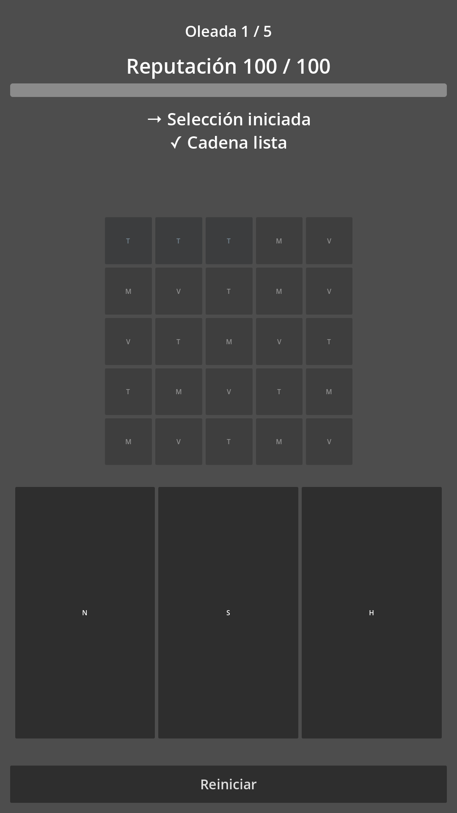
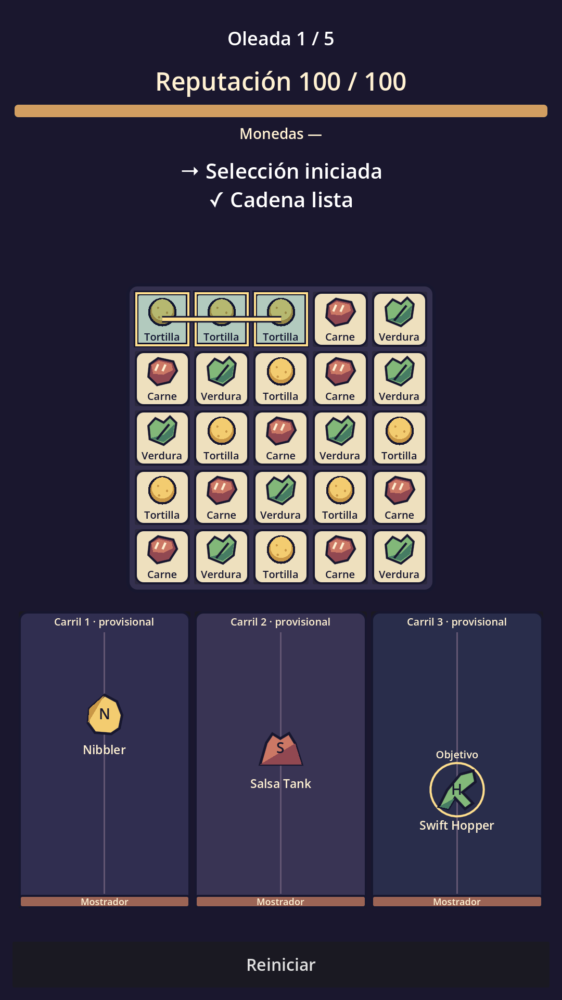
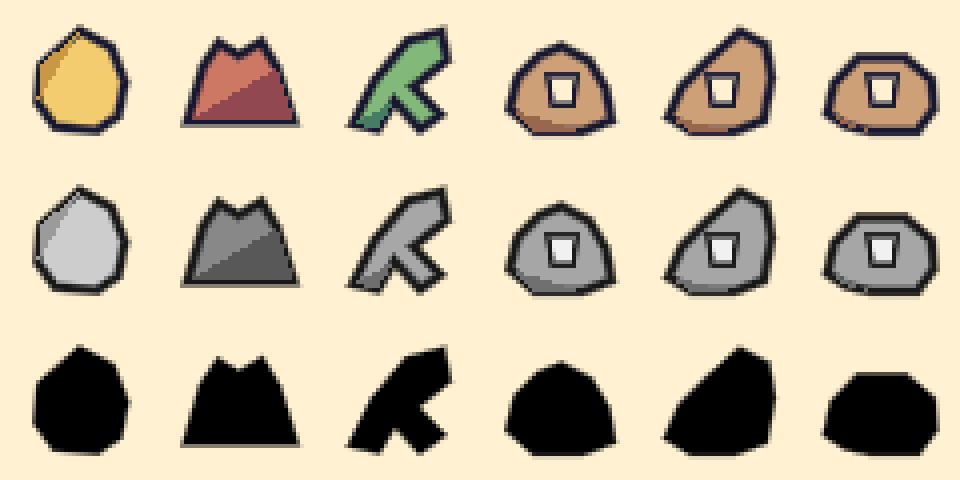

# ART-01 — evidencia de slice 1

**Lista para revisión; ART-01 no concluido. DRAFT exclusivamente contra uat. NO MERGE.**

Fecha local: 2026-10-07. Código evaluado: `3177105f6f712dd746f9b48b6b96916e21b4dce6`; base: `d46cc8cdebb363a7791da8417d78870da3e676d1`. El commit posterior agrega esta evidencia, no cambia producto. Godot `4.7.2.stable.official.ed1daf0bf`, macOS Apple M2. Capturas y prueba de carga: **Metal 4.0 / Forward Mobile** del proyecto; pruebas lógicas headless. No hubo dispositivo iOS/Android.

## Mejora y comparativa

Ingredientes con pictogramas y nombres, trazado ortogonal visible, ambiente azul-violeta con mostrador cálido, tres carriles, tokens de monstruos etiquetados, objetivo real indicado, reputación identificada y «Monedas —» aprobado como pendiente. No hay nueva puntuación, vidas, pedidos, chef ni reglas. Los proxies sustituyen visualmente las letras nativas sin editar BoardView.gd o LaneRunner.tscn. Por tanto, los aumentos de fuente de #61 siguen en sus archivos, pero cuando esta capa está activa se ven los pictogramas/tokens; revisar esa interacción de producto aunque no haya conflicto de código.

Capturas preparadas con **la misma fixture congelada**: semilla de tablero 20260920, primera cadena T/T/T y tres runners en progress 0.28/0.46/0.68. No se presentan como partida jugada. El baseline se extrae por `git archive` del SHA fijado, ejecutando el mismo script de captura. El layout sigue siendo el de uat, pendiente de #62. Los PanelContainer del baseline pueden reordenar los Control de runners durante el frame congelado; el render ART-01 usa la fuente lógica `motion.progress` y por eso muestra su distancia real. La prueba nueva compara proyección y selección con el servicio efectivo.

| Antes: uat | Después: ART-01 |
|---|---|
|  |  |

[1080×1620](evidence/after-1620.png) · [1080×2400](evidence/after-2400.png) · jefe [Calma](evidence/boss1.png) / [Hambre](evidence/boss2.png) / [Embate](evidence/boss3.png).

Las capturas del jefe son fixtures visuales: configuran sus fases desde boss.json; la secuencia real de quinta elección está verificada por BOSS-01 y el bot runtime, no por esas imágenes.

## Resultados

| Verificación / comando | Resultado | Evidencia |
|---|---|---|
| `godot --headless --path . --editor --quit` | PASS, sin diagnósticos de script | [import](evidence/import.log) |
| `bash tests/run_core_suite.sh` | PASS 23/23 archivos | [core](evidence/core.log) |
| `godot --headless --path . --script res://tests/art_01_visual_test.gd` | PASS 276 checks; objetivo mostrado=servido, desempate, retiro, input ignorado, diagonal rechazada, tres aspectos | [visual](evidence/art_01_visual_test.log) |
| `boss_encounter_test.gd` | PASS quinta elección, un jefe, fases, satisfacción/breach, sin wave_06 | [boss](evidence/boss_encounter_test.log) |
| `reputation_test.gd`, `feedback_test.gd` | PASS HUD, precisión, reputación, cues, Unicode, silencio | [HUD](evidence/reputation_test.log), [feedback](evidence/feedback_test.log) |
| `restart_session_test.gd` | PASS 30/30 casos, 257 checks, 20 reinicios, señales obsoletas | [reinicio](evidence/restart_session_test.log) |
| `save_service_test.gd` | PASS 10 casos / 193 assertions | [SAV-01](evidence/save_service_test.log) |
| `save_recovery_test.gd` | PASS 29 casos / 1023 assertions / 0 skips | [SAV-02](evidence/save_recovery_test.log) |
| `vis_runner_retirement_test.gd`, `vis_runner_event_lifetime_test.gd` | PASS 189 checks y lifetime síncrono | [retiro](evidence/vis_runner_retirement_test.log), [eventos](evidence/vis_runner_event_lifetime_test.log) |
| `m3_runtime_bot.gd` | PASS victoria, cinco oleadas/elecciones, un jefe, reinicio terminal | [runtime](evidence/m3_runtime_bot.log) |
| `bash tests/run_restart_suite.sh` | PASS 10/10 procesos Main + persistencia entre procesos/recuperación | [suite](evidence/restart-suite.log) |
| `python3 tests/run_inp_probe_test.py` | PASS 62 checks sintéticos | [input](evidence/input-probe.log) |
| `python3 tests/run_art_01_evidence.py` | PASS comparativa + tres aspectos + tres fases + 32px + estabilidad desktop | [captura](evidence/after-1920.log), [32px](evidence/legibility.log) |
| Snapshot de #62 `e894b438939e6260a4c8cc6c566373c351ddc2a7` (incluye #61), superposición en copia desechable | PASS import, ui_mobile_layout, ART-01 276, board input 403, lane integration; sin merge | [compatibilidad](evidence/ui-stack-compatibility.log) |
| Safe area sintética (177 arriba / 102 abajo, unidades canvas) | **FAIL del HUD heredado**: invade franja superior; tablero dentro. No aprobación de dispositivo | [layout](evidence/art_01_visual_test.log) |
| Prueba física iOS, ambas manos, calor, consumo, 44 pt y accesibilidad | **NO EJECUTADA** | Pendiente IOS-01/02 e INP-01 |
| Arte original/reconocimiento humano | **PENDIENTE**: referencias ausentes, revisión Xavier no realizada | [pipeline](PIPELINE.md) |

Todos los scripts GDScript de la tabla usan `godot --headless --path . --script res://tests/<nombre>`. El driver `python3 tests/run_art_01_regression.py` conserva salida completa, exige exit 0 y rechaza diagnósticos; solo contempla el diagnóstico específico de JSON corrupto de SAV-02. La suite core incluye 398 checks de mouse/touch real inyectado en viewport; no son toques en hardware. El bot acelerado no demuestra duración humana de 4–5 minutos ni jugabilidad física.

## Legibilidad real a 32 px



Columnas: Nibbler, Salsa Tank, Swift Hopper, jefe Calma, jefe Hambre, jefe Embate. Filas: color, luminancia, silueta negra sin detalles interiores. Cada original tiene **32×32 px**; la hoja amplía 4× por vecino más cercano. Los archivos `token-<columna>-<fila>-32.png` son los originales.

PASS técnico: seis máscaras distintas y sólidas con 487 / 462 / 390 / 480 / 523 / 493 píxeles de cobertura ≥0.5, sin color interior. Inspección visual: los roles normales tienen contornos diferentes; Calma/Embate conservan una masa baja parecida, diferencia perceptual aún por revisar. No hay dientes/rostro/animación exportados: su conformidad no puede aprobarse con proxies. Esta evidencia **no acredita** las cuatro referencias ausentes.

## Rendimiento observado y limitaciones

Misma fixture de siete runners quietos, 60 frames de calentamiento + 180 de muestra; capa visual de carriles activa. El monitor TIME_PROCESS incluye el frame observado, no una medición aislada de GPU. Comparación sin significancia estadística:

| Monitor desktop | Antes | Después |
|---|---:|---:|
| Nodos estables | 72 | 101 |
| Recursos estables | 21 | 28 |
| Huérfanos | 0 | 0 |
| Memoria estática final | 41,382,992 B | 44,057,290 B |
| Draw calls | 59 | 329 |
| Mediana TIME_PROCESS | 18.018 ms | 17.836 ms |
| P95 TIME_PROCESS | 19.341 ms | 19.124 ms |

[Antes](evidence/performance-before.log) / [después](evidence/performance-after.log). Sin crecimiento de conteos en esa ventana. +2.55 MiB estáticos aproximados, +29 nodos y más trabajo de dibujo: **no se declara cumplido 60 FPS ni ausencia de regresión en iPhone**. Medir en IOS-02; si el coste resulta material, rasterizar/atlasear los pictogramas y cachear el fondo en una futura optimización revisada. Los PNG de evidencia tienen `.gdignore`, no se importan como assets de producto.

La fila de monedas añade altura al VBox existente y reduce el tablero disponible; no se alteraron mínimos ni reglas de hit-test. Las pruebas Main aislado registraron celdas de 95/125/173 unidades para alturas 1620/1920/2400; las capturas App incluyen además el footer. No confundir unidades canvas con puntos físicos. Textos y proxies pueden superponerse cuando varios clientes coinciden en un carril; el objetivo se pinta último. Validar densidad y ergonomía con Xavier/#62 antes de aprobar arte o dispositivo.

## Incidencias resueltas durante el trabajo

- Primera importación/captura dentro del sandbox no pudo escribir cachés/abrir la ventana. Se repitió con autorización del entorno; no es un PASS de aquel intento.
- Sombreado inicial cruzaba un polígono: FAIL de triangulación, corregido a triángulo válido; capturas finales sin el diagnóstico.
- Una captura breve emitió aviso de dos ObjectDB al salir; repetición verbose no lo reprodujo. El fixture final usa el seam existente `playback_enabled=false` para capturar en silencio y no cerrar reproducciones de audio sintéticas. Las capturas finales y suites de audio/reinicio pasan; no se atribuye una causa de leak de producción sin evidencia.

## Reproducción y auditoría

Desde un checkout de la rama con Godot 4.7.2 en PATH:

```sh
godot --headless --path . --editor --quit
python3 tests/run_art_01_regression.py
python3 tests/run_art_01_evidence.py
godot --path .
git diff --check
```

El segundo driver abre ventanas del renderer disponible y necesita acceso a una sesión gráfica; en este reporte fue Metal/M2. Escribe logs/capturas reproducibles, sin tocar guardados del jugador. La captura construye una fixture muda; las pruebas de guardado usan fixtures aisladas. El runner de evidencia requiere que el SHA baseline siga disponible localmente. [Handoff específico para Xavier](HANDOFF_XAVIER.md).
