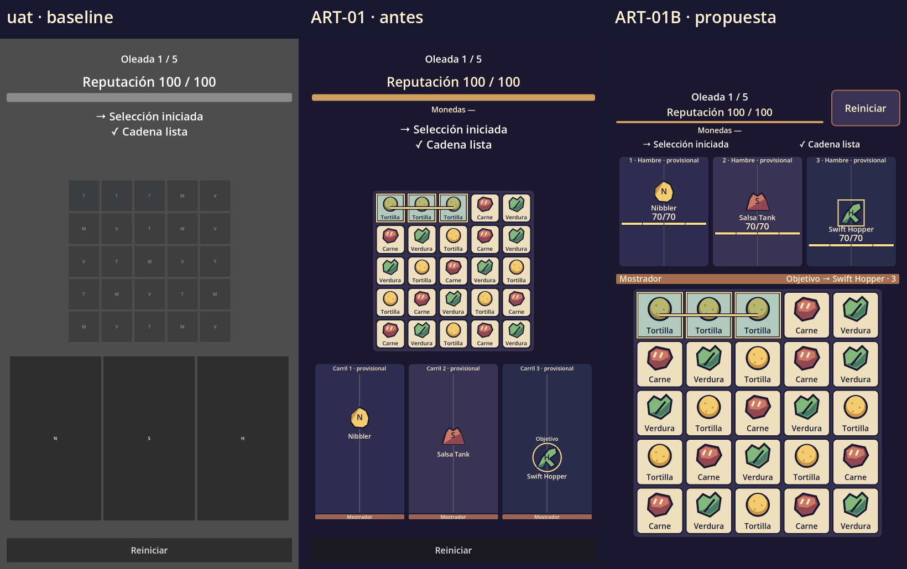

# ART-01B — evidencia para revisión

Propuesta implementada para revisar en el mismo PR #63 DRAFT. No significa aprobación visual de Jorge ni auditoría independiente de Xavier. Sin merge. El histórico de ART-01 permanece intacto.

## Distribución y capturas

| Canvas | Comparación uat → ART-01 → ART-01B | Límites anotados | Grupos | Reinicio | Mejoras |
|---|---|---|---|---|---|
| 1080×1620 | [comparativa](evidence/comparison-1620.png) | [bounds](evidence/bounds-1620.png) | [9 clientes](evidence/crowded-1620.png) | [modal](evidence/restart-1620.png) | [oferta](evidence/upgrades-1620.png) |
| 1080×1920 | [comparativa](evidence/comparison-1920.png) | [bounds](evidence/bounds-1920.png) | [9 clientes](evidence/crowded-1920.png) | [modal](evidence/restart-1920.png) | [oferta](evidence/upgrades-1920.png) |
| 1080×2400 | [comparativa](evidence/comparison-2400.png) | [bounds](evidence/bounds-2400.png) | [9 clientes](evidence/crowded-2400.png) | [modal](evidence/restart-2400.png) | [oferta](evidence/upgrades-2400.png) |



Jefe provisional: [Calma](evidence/boss1.png), [Hambre](evidence/boss2.png), [Embate](evidence/boss3.png). Las capturas de jefe son fixtures explícitas; su aparición después de oleada 5 + quinta elección se valida por separado con las regresiones de boss/run loop.

La fixture comparativa fija N/S/H en carriles 1/2/3 y progresos 0.28/0.46/0.68, hambre 70/70 para conservar equivalencia histórica (no son los valores canónicos de balance), tablero determinista y cadena de tres tortillas. Congela la sesión y deshabilita audio antes de capturar. Los grupos usan nueve clientes, valores canónicos 30/70/18 y hambre fraccional; no son una nueva oleada. Los PNG no se usan en runtime salvo el atlas de tokens.

HUD/reinicio ocupan la franja superior segura. El feedback conserva hasta cuatro mensajes, en dos columnas. Los tres carriles preceden un único mostrador delgado; debajo hay un tablero cuadrado que ocupa hasta 56% de la altura disponible y crece hasta el ancho seguro. La textura compartida deja separados texto, hambre, objetivo, cadena y controles.

## Safe area, controles y pruebas

Godot 4.7.2 `ed1daf0bf`; pruebas headless y capturas gráficas Metal 4.0 / Forward Mobile, Apple M2. No se usó hardware móvil.

`art_01b_layout_test.gd`: **2,005 checks, cero fallos**. Comprueba rects reales, intersecciones y dispatch de input: tres alturas, densidad 3 y densidad 2 con escala canvas 2/3 y origen de pantalla trasladado. Inyecta safe area (12,177,1050,H−279), luego redimensiona con otro rect (0,96,1080,H−176). Comprueba las 25 celdas, orden HUD/carriles/mostrador/tablero, reinicio, cancelación por click real de viewport, touch a cada celda, cadena ortogonal, nueve tarjetas no superpuestas, selector real, paneles, nueva sesión y botón terminal «Nueva partida».

| Perfil principal, escala 3 | Celdas mínimas observadas | Reinicio |
|---|---|---|
| 1080×1620 con safe area | 45.3 pt | ≥44 pt de alto |
| 1080×1920 con safe area | 56.3 pt | ≥44 pt de alto |
| 1080×2400 con safe area | 62.7 pt | ≥44 pt de alto |

Las cifras incluyen redondeo del canvas escalado; no son píxeles convertidos arbitrariamente a puntos. Mejoras y confirmación también permanecen dentro del rect seguro, con opciones ≥44 pt. Fuentes de presentación a escala 3: oleada/reinicio 12 pt, reputación 12.7 pt, monedas 9.3 pt, hambre normal/agrupada 10.7 pt. Los pictogramas, símbolos y barras segmentadas complementan el texto. La lectura con pulgar/dispositivo requiere revisión física.

El FAIL histórico de HUD fuera de safe area en ART-01 se conserva como historia. La aceptación nueva ejecuta **App**, donde reside el adaptador, y demuestra el PASS sintético con rects impresos en `evidence/art_01b_layout_test.log`. El test histórico `art_01_visual_test.gd` sigue probando Main standalone sin adaptador; sus observaciones de máscara no representan App. No se borró ni reescribió su evidencia histórica.

Regresiones ejecutadas: core **23/23 archivos**, ART-01 **276 checks**, boss, reputación, feedback (incluye cuatro cues simultáneos y textos ampliados), restart, save/recovery, retiro de runners, bot M3, suite de reinicio (10/10 ciclos, persistencia entre procesos) e input probe. Todos PASS; los errores de JSON corrupto esperados por save recovery se filtran solo en ese test. Los drivers rechazan parse/script errors, errores inesperados y fugas aunque el proceso devuelva 0.

La composición desechable final superpone las fuentes y assertions exactos de #61 y ejecuta importación, board input, lane integration, ART-01, ART-01B y restart. Todos PASS. #62 exacto pasó el ensayo anterior; su distribución se adapta, no se aplica ciegamente. Los casts VBox/orden de hijos y límite fijo <=64 de su prueba original son sustituidos por geometría real y tamaño en pt. Ver [detalle de compatibilidad](evidence/compatibility-summary.txt) y [delta contra #62](evidence/composition-vs-62.diff).

## Reproducción

```sh
godot --headless --path . --editor --quit
GODOT_BIN=godot python3 tests/run_art_01b_regression.py
GODOT_BIN=godot python3 tests/run_art_01b_compatibility.py
GODOT_BIN=godot python3 tests/run_art_01b_evidence.py
```

La evidencia requiere renderer gráfico. Usa `git archive` de los SHA exactos para uat/ART-01 y no cambia las ramas. `--after-only` permite actualizar la propuesta reutilizando esos baselines inmutables. No ejecutar los drivers históricos ART-01 para almacenar evidencia nueva: escriben en su directorio histórico.

## Rendimiento observado

La misma `art_01_performance.gd` histórica se ejecutó en cada referencia: Main, siete clientes, 60 frames de calentamiento y 180 muestras de `Performance.TIME_PROCESS`. Tres corridas iniciales y dos adicionales por el valor atípico de ART-01B; no se descarta ninguna. Capturas y mediciones gráficas fueron secuenciales, con el renderer configurado del proyecto. [Datos completos](evidence/performance.json).

| Versión | Draw calls | Memoria estática MiB | Nodos / recursos / huérfanos |
|---|---:|---:|---|
| uat | 59 | 39.47 | 72 / 21 / 0 |
| ART-01 | 329 | 42.01 | 101 / 28 / 0 |
| ART-01B | 160 | 44.51 | 103 / 38 / 0 |

| Iteración | uat mediana / p95 ms | ART-01 mediana / p95 ms | ART-01B mediana / p95 ms |
|---|---|---|---|
| 1 | 9.464 / 9.464 | 9.746 / 10.214 | **22.384 / 22.384** |
| 2 | 9.410 / 9.410 | 9.792 / 9.792 | 10.421 / 10.421 |
| 3 | 9.378 / 9.378 | 9.690 / 10.321 | 10.339 / 10.339 |
| 4, seguimiento | 9.449 / 9.449 | 9.510 / 9.653 | 11.506 / 11.506 |
| 5, seguimiento | 9.189 / 9.477 | 9.292 / 9.558 | 10.761 / 10.761 |

ART-01B reduce draw calls **51.4% respecto a ART-01**, con +2 nodos, +10 recursos y aproximadamente **+2.50 MiB** de memoria estática; frente a uat son +5.05 MiB. El atlas evita repetir las primitivas de 25 ingredientes y siete proxies, y se omite el fondo/texto deshabilitado del Button que cubre cada ingrediente. Nodos, recursos y huérfanos permanecen estables entre warmup/final en las cinco corridas; esto no demuestra estabilidad del tiempo de frame.

El pico de 22.384 ms no se repitió en las dos corridas adicionales, pero la causa no está aislada y el costo de proceso observado continúa por encima de ART-01. `TIME_PROCESS` es un monitor periódico leído cada frame, no 180 medidas independientes de latencia ni un perfil GPU; por ello mediana y p95 pueden coincidir. Se conserva el valor atípico y queda pendiente perfilar en dispositivo. No se afirma 60 FPS, ausencia de jank ni mejora general de rendimiento a partir de la reducción de draw calls.

## Límites y pendientes

Las pruebas sintéticas cubren las proporciones indicadas y no certifican todos los teléfonos ni escalas de accesibilidad. El layout prioriza espacio de juego; textos aumentados más allá de los perfiles normales pueden reducir las celdas y `touch_target_met` lo informa. La API de plataforma, safe area real, gestos del sistema, comodidad, consumo GPU y frame pacing requieren los dos iPhone del plan. Android no fue probado.

La fidelidad visual depende de la revisión de Jorge: no se recibió una lámina aprobada Opción 1B, se implementaron las guías escritas. Los personajes siguen siendo geometrías provisionales, incluida la cara ansiosa y dientes redondos del jefe. No hay corazón, puntuación ficticia, avatar del cocinero ni economía nueva. Reglas, datos de balance, guardado, targeting y scripts de sesión permanecen sin cambios.
